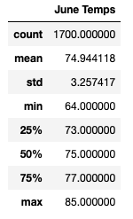
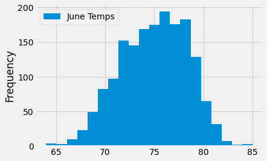
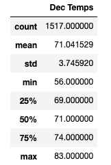
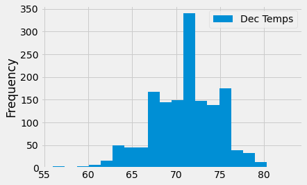
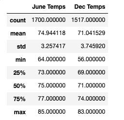

# surfs_up

In this project, we use the data of weather from W. Avy to help us in the business plan for investing in Surf 'n Shake store.

We use the collection of data to create really helpful stats to understand when is the best month of demand of ice cream or condition for surf.

The data source running under SQLite so is perfect to create easy queries to request information 

We select 2 months to compare, June and December to determine any possible difference

## June

In June we have a max temp of 85 and a min of 64 and a mean of almost 75

## December

In December we have a max of 83 and a min of 56 and a mean of 71

## Summary

Overall the temperature in these different months in 2 very different seasons is very similar. We can determinate that weather is not an issue for investing in our idea of the store
